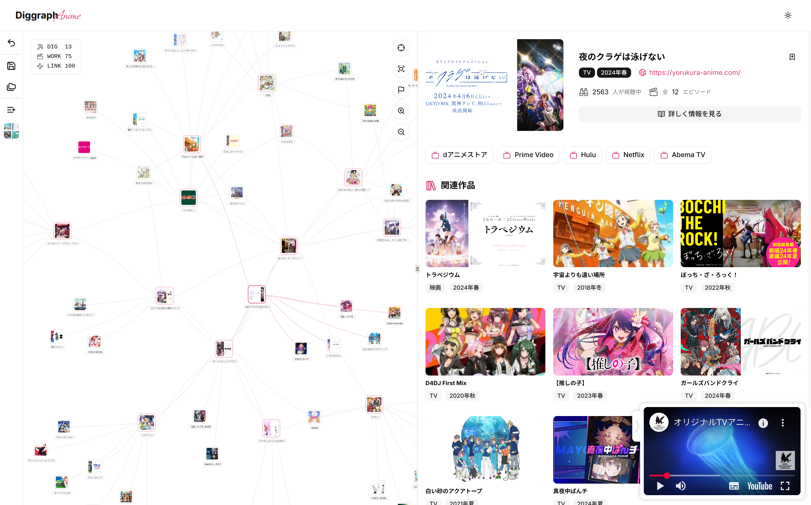

<h1 align="center">
  
</h1>

Explore anime as a graph - search related ones, discover connections.

## Features

- [x] **Interactive Graph Visualization** \
Discover connections between anime titles at a glance.
- [x] **Browsing Anime Info & Reviews** \
Browse detailed metadata, summaries, and user reviews.
- [x] **Save & Share Graphs** \
Keep your personalized graph and share it with friends or on social media.
- [x] **Create Anime Collections** \
Organize your favorite anime into custom lists or watch-lists.
- [x] **Visitor Mode** \
Try some features without Annict account authentication.
- [x] **Dark Mode** \
Switch between light and dark themes for comfortable viewing.

## Development

### Requirements

- Node.js
- pnpm

### Setup

1. Install dependencies: `pnpm i`
2. Copy env file: `cp .env.local.example .env.local`
3. Fill your [env variables](#environment-variables) in `.env.local`
4. Create a database for development: `cp example.db local.db`
5. Migrate the database: `pnpm migrate`
6. Start the development server: `pnpm dev`
7. Open your browser and go to [`http://localhost:3000`](http://localhost:3000)

### Scripts

- `pnpm check`: Check linting and formatting
- `pnpm fix`: Fix linting and formatting issues
- `pnpm typecheck`: Run TypeScript type checking
- `pnpm generate:jikan`: Generate OpenAPI client for Jikan API
- `pnpm generate:db`: Generate database migration code
- `pnpm migrate`: Run database migrations
- `pnpm studio`: Start the Drizzle Studio for database management

## Environment Variables

- `BASE_URL`: The base URL of your application. (default: `http://localhost:3000`)
- `ANNICT_CLIENT_ID`: [Annict OAuth](https://annict.com/oauth/applications) client ID
- `ANNICT_CLIENT_SECRET`: [Annict OAuth](https://annict.com/oauth/applications) client secret
- `ANNICT_TOKEN`: [Annict access token](https://annict.com/settings/tokens/new) (for visitor features)
- `AUTH_SECRET`: Secret for Authentication (can generate in [better-auth docs](https://www.better-auth.com/docs/installation#set-environment-variables))
- `DATABASE_URL`: Database connection string (default: `file:./local.db`)
- `DATABASE_AUTH_TOKEN`: Database authentication token (optional)
